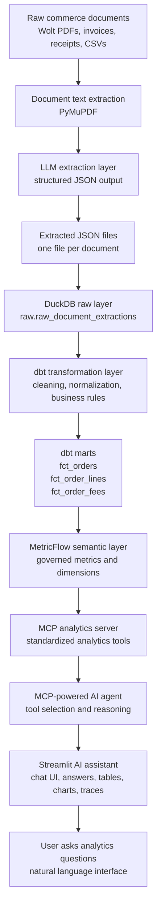
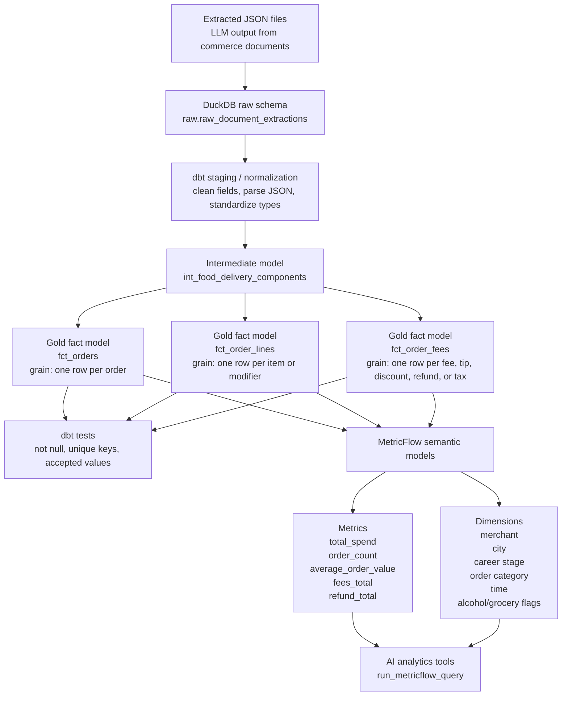
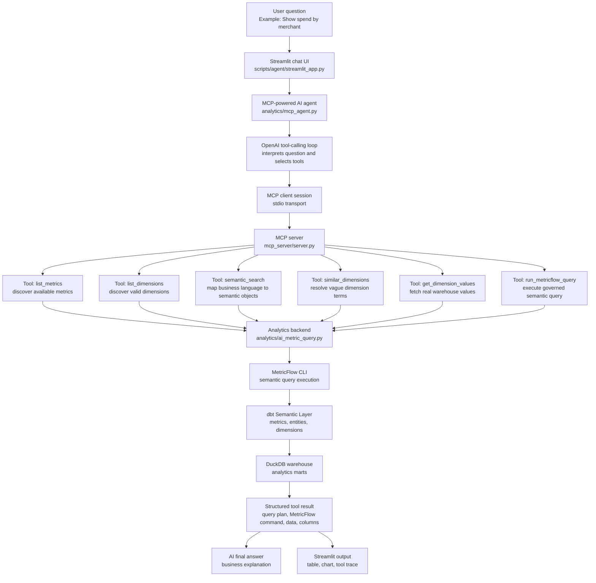

[](https://github.com/aman10795/ai-commerce-analytics-platform/actions/workflows/ci.yml)

# AI Commerce Analytics Platform

An AI-native analytics engineering project that turns unstructured food-delivery documents into governed analytics models and exposes them through a semantic-layer-powered AI assistant.

The platform starts with raw commerce documents such as Wolt invoices, receipts, and order confirmations. It extracts structured data using LLMs, stores it in DuckDB, transforms it with dbt, defines governed metrics through the dbt Semantic Layer and MetricFlow, and enables natural-language analytics through an MCP-powered AI agent and Streamlit interface.

---

## 1. Project Overview

This project is designed as an end-to-end analytics engineering and AI agent system.

It is not just a chatbot over a database. The system separates document extraction, warehouse modeling, semantic metric definitions, AI tool execution, MCP-based tool access, and user-facing analytics.

The goal is to answer questions such as:

```text
How much money did I spend?
Show total spend by merchant.
What was my monthly spend trend?
How many orders did I have in Berlin with alcohol?
Compare alcohol spend vs grocery spend.
Show total spend by career stage.
```

The assistant answers these questions using governed MetricFlow metrics instead of ad hoc SQL generated directly by an LLM.

---

## 2. Why This Project Exists

Most AI analytics demos go directly from a natural-language question to generated SQL. That approach is flexible, but it can be risky because the model may hallucinate columns, use inconsistent business definitions, or bypass governed metric logic.

This project takes a more production-style approach:

* dbt owns transformation logic.
* MetricFlow owns metric definitions.
* MCP exposes controlled analytics tools.
* The AI agent reasons over available tools instead of directly accessing the warehouse.
* Streamlit provides a transparent UI with query plans, MetricFlow commands, results, charts, and tool traces.

The result is an AI analytics assistant grounded in a semantic layer.

---

## 3. Core Capabilities

The platform currently supports:

* PDF and document text extraction
* LLM-based structured JSON extraction
* Raw data storage in DuckDB
* dbt transformation models
* Gold fact tables for orders, order lines, and fees
* MetricFlow semantic layer
* Governed metrics and dimensions
* Semantic search over metrics and dimensions
* MCP server exposing analytics tools
* MCP Inspector compatibility
* MCP-powered AI analytics agent
* Streamlit chat-style analytics UI
* Tool-call tracing and execution logs
* Evaluation scripts for the AI agent and MCP agent
* Anonymized demo data
* Dockerized local demo environment
* GitHub Actions CI/CD
* Docker image publishing to GitHub Container Registry

---

## 4. End-to-End Architecture



---

## 5. Detailed dbt and Warehouse Architecture

The warehouse layer follows a raw-to-intermediate-to-mart structure.

Raw extracted documents are loaded into DuckDB. dbt then standardizes and models them into analytics-ready fact tables.



### Main dbt Models

| Layer        | Model                          | Purpose                                                                                       |
| ------------ | ------------------------------ | --------------------------------------------------------------------------------------------- |
| Raw          | `raw.raw_document_extractions` | Stores extracted document-level JSON                                                          |
| Raw          | `raw.raw_file_registry`        | Tracks source file ingestion metadata                                                         |
| Raw          | `raw.raw_ingestion_log`        | Tracks ingestion runs and load status                                                         |
| Intermediate | `int_food_delivery_components` | Normalizes extracted components such as items, modifiers, fees, discounts, refunds, and taxes |
| Mart         | `fct_orders`                   | One row per food-delivery order                                                               |
| Mart         | `fct_order_lines`              | One row per order item or modifier                                                            |
| Mart         | `fct_order_fees`               | One row per fee, tip, discount, refund, tax, or deposit                                       |

---

## 6. Semantic Layer and MetricFlow

The project uses MetricFlow on top of dbt semantic models to define governed metrics and dimensions.

Example metrics include:

```text
total_spend
order_count
average_order_value
items_total
fees_total
delivery_total
tip_total
discount_total
refund_total
merchant_count
merchant_lifetime_spend
merchant_total_orders
merchant_average_order_value
```

Example dimensions include:

```text
metric_time
order__merchant_name
order__residence_city
order__career_stage
order__order_category
order__contains_alcohol
order__contains_grocery
order__contains_restaurant_food
order__payment_method
order__source_platform
merchant__merchant_name
merchant__source_platform
```

The AI agent does not directly invent SQL. It uses available metrics and dimensions exposed through the semantic layer.

---

## 7. AI Agent and MCP Architecture

The final AI assistant uses an MCP-powered architecture. The agent interprets the user question, decides which tools are needed, calls the MCP server, receives structured results, and generates a final business-readable answer.



---

## 8. Why MCP Is Used

MCP is not required to calculate metrics. The same MetricFlow queries can be executed directly from Python.

The value of MCP is architectural.

MCP turns the analytics backend into a reusable tool server. Instead of tightly coupling the AI agent to internal Python functions, the system exposes governed analytics capabilities as standardized tools.

The MCP server currently exposes:

```text
list_metrics
list_dimensions
semantic_search
similar_dimensions
get_dimension_values
run_metricflow_query
```

This means the same backend can be used by:

* Streamlit AI assistant
* MCP Inspector
* Python MCP test client
* Future Claude Desktop integration
* Future Cursor integration
* Future LangGraph agent
* Other MCP-compatible clients

In simple terms:

```text
Without MCP:
Only this Python app can easily use the analytics functions.

With MCP:
Any MCP-compatible client can use the same governed analytics tools.
```

MCP also improves:

* tool discoverability
* debugging
* separation of reasoning and execution
* controlled access to analytics operations
* future extensibility

---

## 9. Streamlit AI Assistant

The Streamlit app provides a chat-style interface where each user question appears as a separate response card.

Each response card shows:

* user question
* AI answer
* execution mode
* execution path
* query plan
* MetricFlow command
* result table
* result chart
* execution trace
* full agent tool calls

Run the Streamlit app locally with:

```bash
streamlit run scripts/agent/streamlit_app.py
```

Example questions:

```text
How much money did I spend?
Show total spend by merchant.
What was my monthly spend trend?
Show total spend by residence city.
How many orders did I have in Berlin with alcohol?
Compare alcohol spend vs grocery spend.
```

---

## 10. MCP Inspector

MCP Inspector can be used to test the MCP server visually.

Run from the project root:

```bash
npx @modelcontextprotocol/inspector "$(which python)" mcp_server/server.py
```

Then open the localhost URL printed in the terminal.

The Inspector allows manual testing of tools such as:

```text
list_metrics
list_dimensions
semantic_search
similar_dimensions
get_dimension_values
run_metricflow_query
```

This is useful for debugging the tool layer without involving the full AI agent or Streamlit UI.

---

## 11. Project Structure

```text
ai-commerce-analytics-platform/
├── analytics/
│   ├── ai_metric_query.py              # Core analytics tool functions
│   ├── agent.py                        # Direct Python agent
│   ├── mcp_agent.py                    # MCP-powered AI agent
│   └── semantic_metadata.py            # MetricFlow metadata discovery
│
├── mcp_server/
│   └── server.py                       # MCP server exposing analytics tools
│
├── commerce_analytics_dbt/
│   ├── models/
│   │   ├── intermediate/
│   │   ├── marts/
│   │   └── semantic/
│   ├── seeds/
│   ├── snapshots/
│   ├── dbt_project.yml
│   └── packages.yml
│
├── scripts/
│   ├── agent/
│   │   ├── streamlit_app.py            # Streamlit UI
│   │   ├── run_agent.py                # Direct agent terminal runner
│   │   ├── run_mcp_agent.py            # MCP agent terminal runner
│   │   └── build_semantic_index.py     # Semantic search index builder
│   │
│   ├── demo/
│   │   ├── export_raw_fixture.py       # Export private raw fixture from local DuckDB
│   │   ├── anonymize_raw_fixture.py    # Create safe anonymized demo fixture
│   │   └── create_demo_warehouse.py    # Build demo DuckDB warehouse
│   │
│   ├── evals/
│   │   ├── evaluate_agent.py           # Direct agent evals
│   │   ├── evaluate_mcp_agent.py       # MCP agent evals
│   │   ├── test_mcp_client.py          # Full MCP client sanity test
│   │   └── test_mcp_smoke.py           # CI-safe MCP smoke test
│   │
│   └── ingestion/
│       ├── extract_invoice.py          # PDF extraction / LLM extraction workflow
│       └── load_extractions_to_duckdb.py # Load extracted JSON into DuckDB raw layer
│
├── data/
│   ├── demo/
│   │   └── raw_document_extractions_demo.jsonl # Safe anonymized demo fixture
│   └── warehouse/
│       ├── commerce_analytics.duckdb       # Local private warehouse, ignored by Git
│       └── commerce_analytics_demo.duckdb  # Local demo warehouse, ignored by Git
│
├── .docker/
│   └── dbt_profiles/
│       └── profiles.yml                # Docker-specific dbt profile
│
├── .github/
│   ├── dbt_profiles/
│   │   └── profiles.yml                # CI-specific dbt profile
│   └── workflows/
│       └── ci.yml                      # CI/CD pipeline
│
├── Dockerfile
├── .dockerignore
├── requirements.txt
├── pyproject.toml
└── README.md
```

---

## 12. Demo Data and Privacy

The public demo does not use private Wolt PDFs or the private local DuckDB warehouse.

The demo flow uses an anonymized fixture:

```text
data/demo/raw_document_extractions_demo.jsonl
```

This file preserves the structure needed by dbt models while replacing sensitive values such as merchant names, order IDs, document IDs, file paths, hashes, and other identifiers.

The private raw fixture is intentionally ignored by Git:

```text
data/demo/raw_document_extractions_raw.jsonl
```

The private local warehouse is also ignored:

```text
data/warehouse/commerce_analytics.duckdb
```

The demo warehouse can be recreated at any time with:

```bash
python scripts/demo/create_demo_warehouse.py --reset
```

Then validate it with:

```bash
cd commerce_analytics_dbt
dbt build --target demo
cd ..
```

---

## 13. OpenAI API Key Requirement

The AI assistant uses OpenAI for natural-language reasoning and tool-calling.

Anyone cloning or running this repository must provide their own OpenAI API key to use the Streamlit AI assistant or terminal-based AI agents.

Create a `.env` file in the project root:

```env
OPENAI_API_KEY=your_openai_api_key
```

The `.env` file is intentionally ignored by Git and should never be committed.

Without an OpenAI API key, users can still inspect the code, build the Docker image, recreate the demo DuckDB warehouse, and run dbt models. However, live AI querying in Streamlit and the OpenAI-powered agents will not work.

---

## 14. Run with Docker

The easiest way to run the project is with Docker.

The Docker image creates a demo DuckDB warehouse from anonymized fixture data, runs the dbt demo build, and starts the Streamlit AI assistant.

### 1. Create `.env`

Create a `.env` file in the project root:

```env
OPENAI_API_KEY=your_openai_api_key
```

### 2. Build the Docker image

```bash
docker build -t ai-commerce-analytics .
```

### 3. Run the Streamlit app

```bash
docker run --env-file .env -p 8501:8501 ai-commerce-analytics
```

Open:

```text
http://localhost:8501
```

The container uses the anonymized demo environment and does not require the private local DuckDB warehouse.

---

## 15. Run Published Docker Image

The CI/CD pipeline publishes the validated Docker image to GitHub Container Registry.

Pull the latest image:

```bash
docker pull ghcr.io/aman10795/ai-commerce-analytics-platform:latest
```

Run the app:

```bash
docker run --env-file .env -p 8501:8501 ghcr.io/aman10795/ai-commerce-analytics-platform:latest
```

Open:

```text
http://localhost:8501
```

This is useful when running the project on another machine without manually installing Python, dbt, DuckDB, MetricFlow, MCP, or Streamlit.

If the package is private, GitHub authentication may be required before pulling the image. For a public portfolio demo, the package visibility can be changed in GitHub Packages settings.

---

## 16. Run Locally Without Docker

### 1. Clone the repository

```bash
git clone https://github.com/aman10795/ai-commerce-analytics-platform.git
cd ai-commerce-analytics-platform
```

### 2. Create and activate a virtual environment

```bash
python -m venv venvwolt
source venvwolt/bin/activate
```

### 3. Install dependencies

```bash
pip install -r requirements.txt
pip install -e .
```

### 4. Create `.env`

Create a `.env` file in the project root:

```env
OPENAI_API_KEY=your_openai_api_key
```

### 5. Configure dbt profiles

For local private development, your dbt profile should point to:

```text
data/warehouse/commerce_analytics.duckdb
```

For demo development, your dbt profile should include a `demo` target pointing to:

```text
data/warehouse/commerce_analytics_demo.duckdb
```

Example local profile:

```yaml
commerce_analytics_dbt:
  outputs:
    dev:
      type: duckdb
      path: /absolute/path/to/ai-commerce-analytics-platform/data/warehouse/commerce_analytics.duckdb
      threads: 4

    demo:
      type: duckdb
      path: /absolute/path/to/ai-commerce-analytics-platform/data/warehouse/commerce_analytics_demo.duckdb
      threads: 4

  target: dev
```

### 6. Rebuild the private warehouse from extracted JSON files

```bash
python scripts/ingestion/load_extractions_to_duckdb.py
```

Then run:

```bash
cd commerce_analytics_dbt
dbt deps
dbt build
cd ..
```

### 7. Rebuild the demo warehouse

```bash
python scripts/demo/create_demo_warehouse.py --reset

cd commerce_analytics_dbt
dbt build --target demo
cd ..
```

### 8. Test MetricFlow

```bash
cd commerce_analytics_dbt
mf list metrics
mf query --metrics total_spend
cd ..
```

### 9. Build the semantic index

```bash
python scripts/agent/build_semantic_index.py
```

### 10. Test the MCP server

CI-safe smoke test:

```bash
python scripts/evals/test_mcp_smoke.py
```

Full MCP client test:

```bash
python scripts/evals/test_mcp_client.py
```

### 11. Run the MCP agent from terminal

```bash
python scripts/agent/run_mcp_agent.py
```

### 12. Run Streamlit

```bash
streamlit run scripts/agent/streamlit_app.py
```

---

## 17. CI/CD

The project includes a GitHub Actions pipeline that validates the analytics and application stack on every push and pull request.

The pipeline currently performs:

```text
Python dependency installation
Python import smoke tests
Demo DuckDB warehouse creation
dbt parse on demo target
dbt build on anonymized demo data
MCP server smoke test
Docker image build
Docker image publish to GitHub Container Registry on push
```

The CI/CD pipeline has two main jobs:

```text
python-dbt-mcp-checks
docker-publish
```

### CI

CI validates that the project still works after code changes.

It checks:

* the Python package installs
* dbt dependencies resolve
* the demo warehouse can be recreated
* dbt models and tests pass on demo data
* the MCP server exposes the expected tools
* the Docker image can be built

### CD

CD publishes a validated Docker image to GitHub Container Registry.

This allows the project to be run from a published image instead of rebuilding locally.

Example:

```bash
docker pull ghcr.io/aman10795/ai-commerce-analytics-platform:latest
docker run --env-file .env -p 8501:8501 ghcr.io/aman10795/ai-commerce-analytics-platform:latest
```

---

## 18. Evaluation

The project includes evaluation scripts to check whether the agents use the expected tools and successfully execute MetricFlow queries.

Run direct agent evals:

```bash
python scripts/evals/evaluate_agent.py
```

Run MCP agent evals:

```bash
python scripts/evals/evaluate_mcp_agent.py
```

Evaluation checks include:

* expected tools used
* MetricFlow query success
* expected metrics selected
* expected group-by dimensions selected
* structured results returned

Example eval cases:

```text
basic_total_spend
spend_by_merchant
order_count_berlin_alcohol
monthly_spend_trend
spend_by_career_stage
```

Logs are saved under:

```text
logs/evals/
```

Agent execution traces are saved under:

```text
logs/agent_runs/
```

---

## 19. Example MetricFlow Query

A user may ask:

```text
Show total spend by merchant.
```

The agent can translate that into a governed MetricFlow query:

```bash
mf query --metrics total_spend --group-by order__merchant_name
```

The tool result includes:

```json
{
  "success": true,
  "plan": {
    "metrics": ["total_spend"],
    "group_by": ["order__merchant_name"],
    "filters": []
  },
  "metricflow_command": "mf query --metrics total_spend --group-by order__merchant_name",
  "data": [
    {
      "order__merchant_name": "Demo Burger House",
      "total_spend": 24.25
    }
  ],
  "columns": ["order__merchant_name", "total_spend"]
}
```

This makes the assistant transparent and auditable.

---

## 20. Key Design Decisions

### dbt for transformation logic

Business logic is modeled in dbt instead of being embedded inside the AI agent.

### MetricFlow for governed metrics

The agent uses MetricFlow metrics and dimensions rather than generating arbitrary SQL.

### MCP for tool abstraction

MCP exposes analytics capabilities as reusable tools that can be called by different clients.

### Streamlit for transparency

The UI shows not only the answer, but also the query plan, MetricFlow command, results, charts, and tool traces.

### Docker for reproducibility

Docker packages the application, dependencies, dbt project, demo data, and Streamlit runtime into a reproducible environment.

### CI/CD for production readiness

GitHub Actions validates the dbt demo build, MCP server, and Docker image. The CD step publishes a runnable Docker image to GitHub Container Registry.

### Demo data for safe reproducibility

The public repository uses anonymized demo data so the project can be built and tested without exposing private order history or real document contents.

### Lazy metadata loading

MetricFlow metadata and OpenAI clients are loaded lazily so that imports, MCP smoke tests, and CI checks can run without unnecessary startup failures.

---

## 21. Current Limitations

* The public demo uses anonymized sample data rather than the full private dataset.
* The project currently uses DuckDB rather than a cloud warehouse.
* Semantic search depends on a locally generated embedding index.
* The MCP server currently uses stdio transport.
* The system is designed for analytics queries, not arbitrary SQL exploration.
* Docker currently runs a single-container demo architecture.
* The published Docker image still requires a user-provided OpenAI API key for live AI querying.
* Some natural-language questions may require additional semantic metadata or improved agent instructions.

---

## 22. Future Improvements

Potential next steps:

* Add more delivery platforms beyond Wolt.
* Expand semantic models for order lines and order items.
* Add richer item-level and category-level analytics.
* Add graph analytics over orders, merchants, items, and categories.
* Add forecasting tools for spend prediction.
* Expose forecasting and graph analytics through MCP tools.
* Add anomaly detection for unusual orders or fees.
* Add cost and latency monitoring for LLM calls.
* Add LangGraph-based agent orchestration.
* Add a cloud warehouse version using BigQuery or Snowflake.
* Add more robust semantic search over dbt docs and model metadata.
* Add support for authentication and multi-user deployment.
* Add screenshots and demo GIFs to the README.
* Add optional hosted deployment using Cloud Run, Render, Railway, or Azure Container Apps.

---

## 23. Skills Demonstrated

This project demonstrates:

* Analytics engineering
* dbt modeling
* Semantic layer design
* MetricFlow usage
* DuckDB warehouse development
* LLM-based document extraction
* AI agent tool orchestration
* MCP server/client architecture
* Streamlit product UI
* Docker containerization
* CI/CD with GitHub Actions
* GitHub Container Registry publishing
* Demo data anonymization
* Evaluation-driven AI development
* Data quality and traceability
* Modular software design

---

## 24. Summary

This project demonstrates how an AI analytics assistant can be built on top of a governed semantic layer rather than directly generating SQL.

The final architecture combines:

```text
LLM extraction
DuckDB
dbt
MetricFlow
MCP
OpenAI tool calling
Streamlit
Docker
GitHub Actions CI/CD
Evaluation scripts
```

The result is a modular AI-native analytics platform where unstructured commerce documents become queryable, governed analytics that can be explored through natural language.
